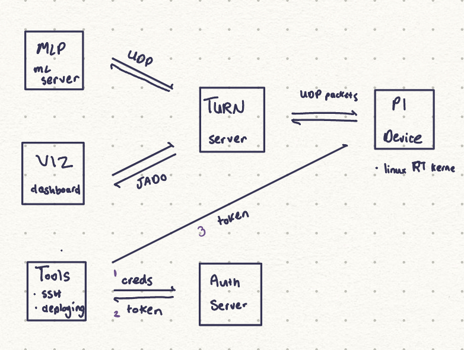

# bmpi

**B**are **M**etal Raspberry **PI**

Building, testing, and deploying bare metal applications directly on to PIs.

## Services

- [**common**](): bare metal applications
- [**mlp**](): webserver for running models 
- [**tools**](): cli for provisioning, connecting, and OTA
- [**viz**](): dashboard for visualizing pi data
- [**webserver**](): authentication webserver

## Application Ideas

- Dictaphone: Generate on-line transcript
  - stream segmented RTP audio packets to MLP server
  - run through Whisper and generate transcript
  - once quiet period detected, transcript emailed to user
- Park Assisst: BEV and blind-spot monitoring for ICE vehicle
  - few cameras connected to RPI
  - stream video to heads-up display
  - use ultrasonic sensors for depth estimation
- Snapshot: Audio and video recorder
  - continously record video and audio into ring buffer
  - when interrupted, we can stream past 30 seconds into backend
  - capture lifes moments without missing them
